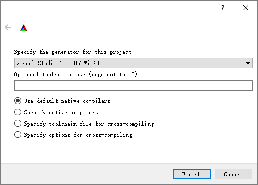

# 编程环境配置
**依赖项：** Kinect SDK提供了获取传感器数据和相机信息的API；需要用到Opencv的图像数据结构、显示、存储等；Eigen中用到四元数等数据结构；
- Kinect SDK 2.0
- Opencv
- Eigen

介绍两种配置方法：
1. VS添加Kinect SDK属性表的方式；
2. 使用Cmake **（推荐）**

## 使用 **cmake gui** 配置
pre-requirements
- vs
- cmake
- Opencv
- Eigen

1. 将Samples目录下的`FindKInectSDK2.cmake`文件复制到Cmake安装目录下的`share\cmake-3.10\Modules\`文件夹中。例如：`D:\CMAKE\share\cmake-3.10\Modules`。
2. Opencv可从官网下载预编译版本，或者使用CMake手动编译，需要注意以下几点：

- 目标平台与库平台的一致性

  也就是说，如果我准备使用vs2017（对应vc 15）开发一个x64平台下基于Kinect点云生成程序，那么编译Opencv时应该选择相同的编译器版本，如下图所示：

    

- Opencv环境变量

  1. 在系统变量中添加`OpenCV_DIR`，值为build目录下包含`OpenCVConfig.cmake`文件的文件夹路径。例如:`D:\opencv3.2\build_vc15_x64\install`;

  2. 在环境变量`Path`中添加opencv `bin`目录，例如：`D:\opencv3.2\build_vc15_x64\install\bin`
